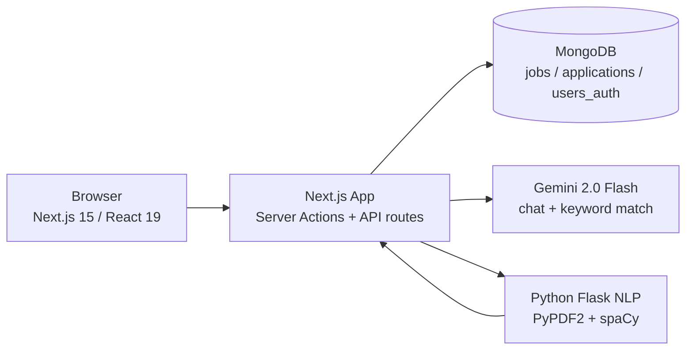

# JobTrackr — AI Job Tracker & Resume Analyzer

Track applications through a real hiring pipeline, analyze resumes with NLP + Gemini, and match against job descriptions with an **explainable score** (not just "78%").

## Problem → Solution

Job hunting spreads across spreadsheets, inboxes, and job boards. Resumes get rejected by ATS filters with no feedback. JobTrackr centralizes both:

1. **Pipeline tracking** — every application moves `Applied → Screening → Interview → Offer / Rejected`, with conversion analytics.
2. **Resume intelligence** — spaCy NLP + Gemini scoring, section feedback, and JD matching that shows *matched / missing / experience overlap*.

## Architecture



- **Next.js** owns auth (NextAuth credentials + JWT), jobs CRUD (server actions), analytics aggregations, and all Gemini calls.
- **Python Flask** (`python-resume-analyzer/`) owns PDF text extraction and section/skill analysis. Used by `POST /api/resume/analyze`. Optional — Gemini keyword matching works without it.
- **MongoDB** stores users (`users_auth` via adapter), `jobs`, `applications`. No ORM; raw driver + zod validation at the boundary.
- **Middleware** (`middleware.ts`) enforces auth server-side: `/dashboard /jobs /resume /analytics /ai /settings` require login, `/admin/*` requires `role: admin`. The client `AuthProvider` is UX only.

## Tech Stack

| Layer | Choice |
|---|---|
| Frontend | Next.js 15.5, React 19, Tailwind, shadcn/ui, Recharts |
| Auth | NextAuth v4 (credentials), MongoDB adapter, bcryptjs |
| Data | MongoDB driver v5, zod validation in actions + API routes |
| AI | `@google/generative-ai` pinned, single model `gemini-2.0-flash` |
| NLP | Flask, PyPDF2, spaCy `en_core_web_sm` |
| Quality | TypeScript strict, vitest, GitHub Actions CI |

## Key Engineering Decisions

1. **One Gemini model everywhere** (`GEMINI_MODEL = "gemini-2.0-flash"` in `lib/gemini.ts`). The old code mixed `gemini-1.5-pro` and `2.0-flash` per function — inconsistent cost/latency/quality.
2. **Explainable matching over a bare score.** `compareKeywords` prompts for `{ score, matched, missing, experienceOverlap, breakdown, summary }`, normalized by pure `normalizeMatchResult()` (`lib/match.ts`) so legacy `{ matching, missing, score }` clients keep working.
3. **Canonical pipeline statuses** (`lib/application-status.ts`): `applied | screening | interview | offer | rejected`, with legacy aliases (`interviewing → interview`, `ghosted → rejected`). Funnel math is cumulative in `computePipelineMetrics()` — reaching interview implies screening.
4. ** Fail-fast env handling.** `lib/env.ts` validates with zod; `lib/mongodb.ts` is lazy so `next build` / CI works without live secrets (previously it threw at import time). `PYTHON_BACKEND_URL` defaults to `http://localhost:5001/analyze` everywhere.
5. **Auth split correctly.** `authOptions` moved from the route file to `lib/auth.ts` (Next 15 rejects non-route exports from `route.ts`); middleware is the security boundary, not the client provider.
6. **Pinned what was `latest`.** `@google/generative-ai`, `next-themes`, `recharts`, `uuid`, `cmdk` were unpinned; `mongodb` downgraded 6→5 to match `@next-auth/mongodb-adapter@1.1.3` peer range; `react-day-picker` 8→9 and `vaul` 0.9→1.1 for React 19 support.
7. **Deprecated the mock.** `POST /api/keyword-match` returned hardcoded skills — now `410` pointing at the real `/api/resume/compare-keywords`.

## How to Run

```bash
# 1. Frontend
cp .env.example .env.local   # fill MONGODB_URI, NEXTAUTH_SECRET, GEMINI_API_KEY
npm install
npm run dev                  # http://localhost:3000

# 2. Python NLP backend (optional but recommended for resume upload)
cd python-resume-analyzer
python3 -m venv venv && source venv/bin/activate
pip install -r requirements.txt
python -m spacy download en_core_web_sm
PORT=5001 python app.py       # http://localhost:5001/analyze
```

Seed an admin user via `/register`, then set `role: "admin"` directly in `users_auth` (there is no public admin signup by design).

## Testing

```bash
npm run typecheck   # tsc --noEmit (no more ignoreBuildErrors)
npm test            # vitest — pipeline math + match normalization
npm run build       # production build (needs MONGODB_URI + NEXTAUTH_SECRET)
```

CI (`.github/workflows/ci.yml`) runs all three on every push/PR. Core coverage lives in `lib/__tests__/match.test.ts`: cumulative funnel, alias normalization, legacy match-shape compat, score clamping.

## Deployment

- **Frontend → Vercel.** Set `MONGODB_URI`, `NEXTAUTH_SECRET`, `NEXTAUTH_URL`, `GEMINI_API_KEY`, `PYTHON_BACKEND_URL` in project env. `GET /api/health` is the liveness probe. `vercel.json` is minimal (framework auto-detect; old `builds` syntax removed).
- **Python backend → any container host** (Cloud Run / Render / Fly). `python-resume-analyzer/Dockerfile` serves gunicorn on `PORT` (default 5001) with `/health`. Point the frontend's `PYTHON_BACKEND_URL` at it. Restrict Flask CORS from `*` to your frontend domain before going public.

## Screenshots / Demo

> TODO: record a 60s Loom after deploying — dashboard → resume analysis → keyword match with breakdown → analytics funnel — and link it here.

Existing screenshots in the original README are stale (May 2025) and omitted intentionally until fresh ones are captured from this branch.
